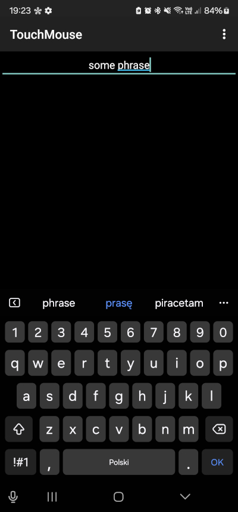
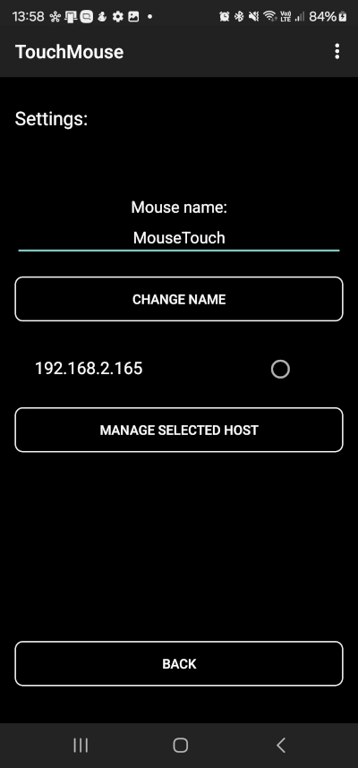

# TouchMouse
**TouchPad for PC - Turn Your Android Device into a Wireless Touchpad**

___

## Features

- **Wireless Control: Connect via Wi-Fi.**
- **Multi-Touch Support: Pinch, scroll, swipe, and tap with ease.**
- **Open and free! No adwords and paywalls. All the features always will be free.**

## Tech stack
- **Desktop App**
    - Java 22 with Maven
- **Mobile App**
  - Native Android Application written in Java
- **Connection**
    - TCP for connecting and connection monitoring
    - UDP for sending mouse move, mouse click and scroll
    - Broadcasting 

## Get started
Download this repo, go to TouchMouseServer directory and build desktop app:
```bash
mvn clean install
```
Next run app:

```bash
java -jar .\target\ToucMouse-0.1.0-SNAPSHOT-jar-with-dependencies.jar
```
The desktop application should be running and broadcasting itself. Next, you need to run the mobile app. The best way to do this is to import the TouchMouseClient into Android Studio. It is strongly recommended to use your physical mobile phone to run the app. Both the desktop and mobile devices must be connected to the same network.

The mobile application will attempt to connect automatically upon startup. However, if it doesn't connect within 30 seconds, you can manually click the "Reconnect" button in the app. Once the phone is connected to the server, you can move your finger on the screen to control the mouse cursor. A quick tap will simulate a left mouse click, while holding one finger and tapping with a second finger will simulate a right mouse click. To scroll, move two fingers on the screen.

In the desktop application, you can click on the app icon in the system tray to display the app menu. Here, you can view the list of connected and saved mice, disconnect or remove a selected mouse, and click on "Info" to display the app version, detected interfaces, and hostname. By right-clicking on the icon in the system tray, you can disconnect all services (TCP, UDP, and broadcast). After disconnecting, you can restart all services by clicking the "Reconnect" button.
However if you using Windows, you can run compiled desktop .exe app from apps directory. Windows app exe is in TouchMouse.zip archive.

### Connecting


### Using
On start application will start connecting process, you have to wait for host connection


Here is the touchpad activity. Quick tap on this screen will be mouse button down and next mouse button up event on pc. Two fingers scrolling will scroll your active window on PC. For contect menu please hold one finger and quick tap second.

;

When you swipe from the bottom edge, the keyboard will appear, and you can type letters as you would on a computer keyboard. In the top field, you will see the text you've typed. However, note that if you type something on a physical keyboard connected to the computer, the text field at the top will not display the correct text; it will only show the phrases you typed on your mobile device. To close typing mode, hide keyboard and next push back button on the device.
### Settings



On the settings screen you can change the mouse name, or go to host manager.


You can disconnect a connected host or remove any PC. The removal action will also disconnect the host.


In the desktop application you can remove and disconnect phone touchpad. Also you can go to the information screen and see broadcast interfaces, your hostname, ip and app version.

All screenshots are from a physical device

## Realease
#### Windows and Android apps v0.2.0 are currently available.
The app's codebase is on a versioned release branch, such as release_0.2.0.
Make sure that the mobile and desktop applications you download are the same version, downloading different versions may cause different results.    
<https://ftp.adamantum.site/TouchMouse/>    
Note: On Android, you have to enable the "Install from unknown sources" option. On Windows, the application is not signed, so Windows Smart Screen will warn you that the application might harm your system. However, this is not true. All the apps are safe.


## Future Enhancements

Here are the planned improvements and features for TouchMouse:

1**Media buttons**:
    - Add media control buttons for pause, stop, and next track to control any currently playing media.

2. **Default and current active mouse**:
    - Allow users to select currently active and default mice in desktop application
3. **Mouse options**:
    - Advanced settings like mouse sensitivity

6. **Linux application**:
    - Build .rpm and .deb desktop app for Linux
7. **Deploy mobile app into Google Play**

## Contributing ##
Feel free to open issues or submit pull requests. All contributions are welcome!

## License

This project is licensed under the [MIT License](LICENSE).  
Feel free to use, modify, and distribute it as long as the terms of the license are followed.